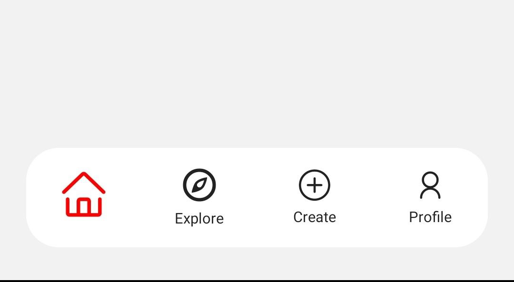

# Bottom Bar Component (React Native)

This is a customizable Bottom Bar component for React Native, developed using **Expo Router** and **TypeScript**. The Bottom Bar can be easily integrated into any React Native project to provide a modern and user-friendly navigation experience.

   

## Features

- **Customizable Icons and Labels**: Easily change the icons and labels to suit your app's needs.
- **Easy Integration**: Simple to integrate with any React Native project using Expo.
- **TypeScript Support**: Fully written in TypeScript for type safety and improved developer experience.
- **Clean Folder Structure**: Follows Expo Router's best practices for managing tabs, ensuring a clean and maintainable codebase.

## Usage

You can integrate the Bottom Bar component into your app and customize it according to your needs. The component is designed to be flexible, making it easy to create a seamless navigation experience for your users.

## Best Practices

This project uses **Expo Router** with a tab-based structure for managing navigation, ensuring a clean, scalable, and maintainable folder organization. By following Expo Router’s best practices, the project remains easy to manage and extend as needed.

## Inspiration

This component was inspired by a **YouTube tutorial**. I extended the concept by using **TypeScript** for better type safety and refactored the folder paths to follow **Expo Router’s best practices**.

Channel of the guy
[Code With Nomi](https://www.youtube.com/@codewithnomi)

## License

This project is open-source and available under the [MIT License](LICENSE).

---
